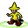

# Bloatcrawl 2

Bloatcrawl 2 is a fork of [Dungeon Crawl Stone Soup](https://crawl.develz.org/) ([github](https://github.com/crawl/crawl)). If you aren't familiar with the base game this fork probably won't make any sense.

## Contents

1. [New Species](#new-species)
2. [New Backgrounds](#new-backgrounds)
3. [Other New Stuff](#other-new-stuff)

## New Species

*  **Argons** are, unlike most other living beings, made of gas. They can only gain resistances by levelling up.
* Strange beings from beyond the stars, **Astrals** cannot gain resistances to magic or the elements. Their attacks inflict powerful debuffs on beings from this world.
*  **Bunyips** are strange, black, oily creatures that live in billabongs. They swim well but cannot call on divine powers or wear armour.
* **Dab Dwarves** have perfected the ancient art of dabbing. They can dab on multiple creatures at once and may even daze their foes with the power of their dab.
* **Ember Elves** have depleted magical reserves, but regenerate magical power quickly. As they develop, their magic becomes more powerful but harder to control.
*  **Faerie Dragons** are attuned to magic and their spells cost fewer magic points. Their shimmering scales repel attacks and their wings let them fly.
* **Flans** are gelatinous and slightly corrosive beings. Their fluid shape lets them fit easily into any body armour, but they cannot wear other armour types.
*  **Fungoids** are mushroomy humanoids with roots instead of feet. They cannot move when monsters are around, but release confusing spores at enemies when they attack.
* **Gnomes** are small creatures who are highly attuned with the earth. They are skilled in the use of magical devices and ranged weaponry.
*  Rolling around at the speed of sound, **Hedgehogs** have got places to go and gotta follow their rainbow.
*  **Hermit Crabs**: These clever crustaceans move into larger shells over time. If their shell is broken in an attack, they can usually escape and find a smaller replacement.
* **Irits** are magical, brutish one-eyed humanoids. They are adept at casting spells in heavy armour, although it costs them life force to do so.
* **Kitsune** are enthralling fox spirits that take on human shapes. They are poor at most skills and frailer than humans, but can charm their foes.
*  **Leprechauns** are small and frail but versatile. Their intrinsic luck gives them a knack for finding better items.
*  Half insect, half human, **Mayflytaurs** have incredibly short lifespans but have evolved to be exceptionally overpowered in just about every imaginable way.
* Strange phantoms summoned from the mirror world, **Mirror Eidola** rapidly fade away. They must slay other creatures and take their energy to stay in this plane.
*  **Oni** are monstrous in nature with the rough appearance of Ogres, albeit smaller. They discover spells as they gain experience and ignore schools of magic.
* Deeper than a Deep Elf and twice as elven, **Profound Elves** are extremely frail magical experts.
*  **Proteans** are a race of vaguely humanoid amoebas. They grow in health and size as they mutate.
* **Quill orcs** love to read and hate close combat. They read books and scrolls at an uncanny pace.
* **Ratlings** are verminous humanoids that mature at an incredible pace, but learn very slowly. They have an affinity for poison magic.
*  **Robots** are metallic humanoids crafted by Dwarves. They break equipment when uninstalling it and have a poor grasp of religion, but can shoot lasers.
*  **Shapeshifters** imitate monsters around them to an uncanny degree. They cannot control their shifting, and are only rarely seen in their true form.
*  **Silent Spectres** are terrible spirits that bring an unearthly silence to the area around them, preventing spell casting, divine invocations and even reading scrolls.
*  **Slitherier Nagas** are offbrand Nagas, and about twice as much everything. Extremely healthy, extremely stealthy, extremely big, and excruciatingly slow.
* Less dextrous than other elves, **Squat Elves** have mastered the art of the power squat. They use this ability to enhance their strength and intelligence.
*  **Turtles** are hard-shelled warriors trained in the arts of ninjutsu. They fight evil wherever it can be found and follow a strict honour code.
* Deeper than deep, **Unfathomable Dwarves** cannot heal even through divine means. However, they have adapted to heal on kills and brew ambrosia potions from leftover life essence.
*  **Unipodes** are distantly related to Octopodes, but have a single tentacle instead of eight. They can only wear one ring and cannot use two-handed weapons.
* The permanently baked **Weed Elves** aren't quite as smart or nimble as other elves, but they are still skilled at magic. They trail smoke wherever they go.
* **Xeno Elves** are strange insectoid elves from a distant land. Their magical efficiency is far better than most species, but their magic drains when moving near enemies.
*  **Yeti** are large, seldom-seen creatures that live on frozen mountain peaks. Sufficiently mature Yeti passively freeze adjacent foes.
*  **Zodach** are the burnt-out remnants of a decayed celestial species. Nearby monsters are drawn in by their immense gravitas.

## New Backgrounds

*  **Alchemists** bring some homebrewed potions and a very special hat on their dungeon adventure.
*  No Kings, No Rulers (maybe a god though). **Anarchists** are bent on dismantling the dungeon hierarchy with rocks and explosives.
*  Thoroughly inept at fighting but well dressed, **Archaeologists** enter the dungeon looking to cast light over the origins of ancient relics.
*  **Aspirants** are novices at magic who have acquired books of powerful magic. They hope to one day master the spells within.
*  When the revolution comes, some **Billionaires** flee the surface and enter the dungeon with a fraction of their hoarded wealth.
*  Servants of the demon god Makhleb, **Blood Knights** begin with moderate skill in combat and quickly learn to harness Makhleb's destructive power.
*  **Bound** serve Ashenzari, the god of curses, and begin their journey partially bound with cursed equipment.
*  **Cavepeople** start with exceptional strength but, unfortunately, neolithic weapons.
*  Lots of people wish they could cast spells in heavy armour. **Chaincasters** do something about it.
*  **Dancers** have left their friends behind and entered the dungeon in service of Uskayaw. They have few combat skills but are quite good at evading attacks.
*  Pontiffs of Yredelemnul, **Death Bishops** carry an unholy staff and use the pain spell in service of their evil god.
*  **Deprived** start with nothing but a ration and almost no skills. Survival may prove... difficult.
*  **Derserkers** are ex-berserkers, who ran off with excellent weapons. Now, they must face Trog's terrible wrath.
*  **Disciples** follow the Wu Jian Council and begin the game with a good weapon.
*  **Doctor**: Medical professionals from the surface occasionally enter the dungeon. They follow the healer god Elyvilon.
*  **Entomologists** study insects and related creatures. They bring along a net and a sack of spiders, and can also summon butterflies.
*  Incredibly dextrous, **Fencers** enter the dungeon with a rapier, fencer's gloves, and an amulet of the acrobat.
*  **Gambler**: Followers of Nemelex Xobeh who have lost everything in a run of bad luck sometimes venture into the Dungeon. They'll need Nemelex's help to turn things around.
*  **Gardeners** worship Fedhas Madash and enter the dungeon to grow shrooms.
*  **Gongers** gong. They gong real loud.
*  Followers of Ru, **Hermits** renounce the world and follow the path of asceticism.
*  **Inheritors** worship Hepliaklqana. The spirit of their ancestor follows them to the dungeon, and given their lack of skills they may need to rely on it.
*  **Kikumancers** are like Necromancers, but they worship the god of necromancy instead of starting with a book of spells.
*  **Librarians** come to the Dungeon in search of new books for their collection. They serve Sif Muna the Loreminder and bring a random book along with them.
*  **Merchants** are followers of Gozag. Whether newly established or unsuccessful on the  surface world, they enter the Dungeon desperate for a source of income.
*  **Meteorologists** predict the weather and carry around some handy evocable items to make their predictions come true.
*  The **Misfortunate** received an unlucky robe from some shady source. Perhaps the robe attracted them to the dungeon for some reason?
*  **Neckbeards** come to the Dungeon from their moms' basements with a cape, a fedora, a rusty katana and the ability to teleport behind you (nothing personal, kid).
*  **Night Knights** follow the shadowy god Dithmenos. They begin lightly armoured but with good stealth.
*  **Overseers** can summon lesser demonic slaves, and eventually even call forth a limb of their true patron. What they traded for this power is unknown.
*  **Paladin**: Worshippers of The Shining One, these holy warriors fall down a lot.
*  **Philosophers** bring their thinking hat to the dungeon, but not much else in the way of useful items.
*  **Ronin** are wandering warriors. They start with simple weapons and gain a little additional piety with the first god they worship.
*  **Slime Priests** follow Jiyva, the slime god. They enter the dungeon already mutated by their deity's power but with only a small amount of divine favor.
*  Highly accurate users of ranged weaponry, **Snipers** wear amulets of harm to boost their damage capabilities.
*  **Soothslayers** are battlemages who begin with a variety of simple magic in addition to their weapon.
*  **Stalkers** are assassins who have some aptitude in the use of poison magic.
*  **Storm Clerics** spread destruction in the name of Qazlal.
*  **Torpor Knights** follow Cheibriados and wear heavy, ponderous armour to gain their god's favour more quickly.
*  **Uncles** search the dungeon for their lost nephews.
*  It's opening night for "The Orb of Zot" and the hero is sick! The **Understudy** must learn their role quickly if they want to make it through the final act.
*  **Warriors** are followers of Okawaru who bring a variety of equipment to the dungeon.
*  Have you heard the good news of Beogh? **Witnesses** have.
*  **Zinjas** worship Zin and very stealthily recite the Aixoms of Law.

## Other New Stuff

* **Dab** at any time with the `p` key.
* **Game Modifiers**: Select game modifiers when starting a new game. Play any species as a mummy. Remove rune locks. Etcetera.
*  Unleash the elemental power of sound with the **Air Horn** evocable.
* Be careful in  Pandemonium lest you disturb **THE GIAGGOSTUONO**, a hecka big dinosaur thing that breathes fire and shoots lasers from its eyes. Its hard skin is nearly indestructible.
